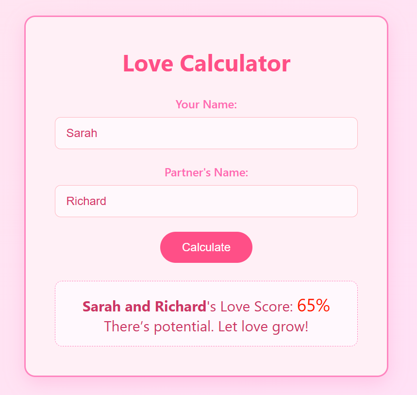

# 💖 Love Calculator

A fun and modern love calculator built with HTML, CSS, and JavaScript.

## 🌟 Features
- Dynamic love percentage calculation based on names
- Fun and randomized love messages
- Beautiful pastel-themed responsive design
- Live demo hosted on GitHub Pages

## 🔗 Live Demo
👉 [Try the Love Calculator](https://ktsaneff.github.io/love-calculator/)

## 📁 Project Structure
├── index.html
├── script.js
├── styles.css
└── README.m

## 🛠️ Technologies Used
- HTML5
- CSS3
- JavaScript (Vanilla)

## 📸 Screenshots
## 📸 Preview

## 📄 License
This project is open-source and free to use.
